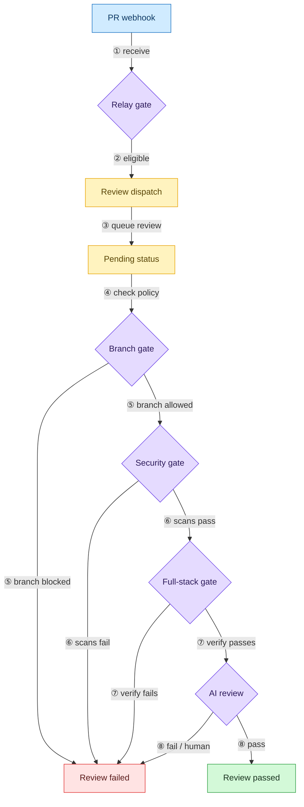

```mermaid
graph TB
    Webhook["PR webhook"]
    Relay{"Relay gate"}
    Dispatch["Review dispatch"]
    Pending["Pending status"]
    Branch{"Branch gate"}
    Security{"Security gate"}
    FullStack{"Full-stack gate"}
    Review{"AI review"}
    Failed["Review failed"]
    Passed["Review passed"]

    Webhook -->|"① receive"| Relay
    Relay -->|"② eligible"| Dispatch
    Dispatch -->|"③ queue review"| Pending
    Pending -->|"④ check policy"| Branch
    Branch -->|"⑤ branch blocked"| Failed
    Branch -->|"⑤ branch allowed"| Security
    Security -->|"⑥ scans fail"| Failed
    Security -->|"⑥ scans pass"| FullStack
    FullStack -->|"⑦ verify fails"| Failed
    FullStack -->|"⑦ verify passes"| Review
    Review -->|"⑧ fail / human"| Failed
    Review -->|"⑧ pass"| Passed

    class Webhook transport
    class Dispatch,Pending protocol
    class Relay,Branch,Security,FullStack,Review decision
    class Failed blocked
    class Passed success

    classDef success   fill:#d3f9d8,stroke:#2f9e44,color:#1a3620
    classDef transport fill:#d0ebff,stroke:#1971c2,color:#0b3866
    classDef protocol  fill:#fff3bf,stroke:#e8a400,color:#5c4500
    classDef blocked   fill:#ffe3e3,stroke:#e03131,color:#5c1a1a
    classDef decision  fill:#e5dbff,stroke:#7048e8,color:#2c1a5c
```
